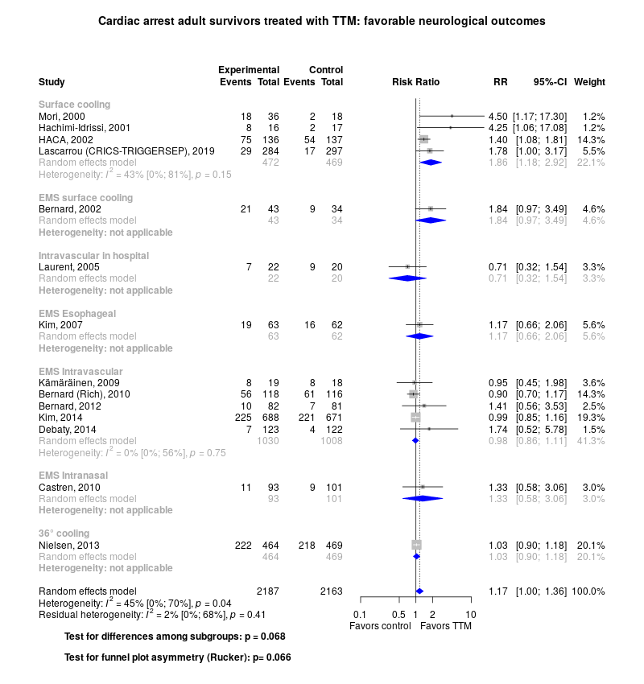

Cardiac arrest treatment with targeted temperature management
============================================
A living systematic review

Short url: http://openmetaanalysis.github.io/cardiac-arrest

**Clinical summary:** This meta-analysis suggests that clinical intervention *is* effective when surface cooling is used in adults. Heterogeneity of results as measured by I2 was '[moderate](https://training.cochrane.org/handbook/current/chapter-10#section-10-10-2)' at 9%. This review updates previously published meta-analysis(es).(citation[s] below)
<!--
Meta-regression of common modulators (year of publication, study size, event rate in the control groups) finds that the outcome of the intervention is effected by xx. -->
* [Reconciliation of conclusions with prior meta-analyses](files/reconciliation-tables/Reconciliation%20of%20conclusions.pdf) (under construction)
* [Keep current with this topic](files/searching/Keep-up.md) (under construction)

Acknowledgement: we acknowledge the essential work by the authors of the prior [systematic review(s)](#systematic-reviews) listed below.

**Methods overview:** This repository is an [openMetaAnalysis](https://openmetaanalysis.github.io/) that combines methods of scoping, rapid, and living systematic reviews.  This analysis updates one or more previously published review(s) below. A comparison of studies included in this review compared to prior reviews are in the table, [reconciliation of trials included with prior meta-analyses/](files/reconciliation-tables/Reconciliation%20of%20studies.pdf). Newer studies included are listed in the references below. Rationale for newer trials excluded may be listed at the end of the references. 
* [Methods](http://openmetaanalysis.github.io/methods.html) for openMetaAnalysis
* [Evidence search](files/searching/evidence-search.md) for this review (under construction)

**Results:** Details of the studies included are in the:
* [Reconciliation of trials included with prior meta-analyses/](files/reconciliation-tables/Reconciliation%20of%20studies.pdf) (under construction)
* [Description of studies (PICO table)](files/study-details/table-pico.pdf)
* [Risk of bias assessment](files/study-details/table-bias.pdf) (under construction)
* [Forest plots](../master/files/forest-plots) ([source data](files/data))
* [Network plots](../master/files/network) (optional)
* [Reconciliation of conclusions with prior meta-analyses](files/reconciliation-tables/Reconciliation%20of%20conclusions.pdf) (under construction)

The forest plot for the primary outcomes are below. Additional [forest plots](files/forest-plots) of secondary analyses may be available. 

<!--
The meta-regression for the primary outcomes are below. Additional [meta-regressions](files/metaregression) of secondary analyses may be available. 

The GRADE Profile is below. 
-->

References:
----------------------------------

### Systematic review(s)
#### Most recent review at time of last revision of this repository
1. Barbarawi M, Alabdouh A, Barbarawi O, Lakshman H, Alkasasbeh M, Rizk F, Bachuwa G, Alkotob ML. Targeted Temperature Management in Cardiac Arrest Patients With an Initial Non-Shockable Rhythm: A Systematic Review and Meta-Analysis. Shock. 2020 Nov;54(5):623-630. doi: 10.1097/SHK.0000000000001550. PMID: [32433212](http://pubmed.gov/32433212).

### Randomized controlled trials
#### New trial(s) *not* included in the most recent review above
1. Bernard SA, Gray TW, Buist MD, Jones BM, Silvester W, Gutteridge G, Smith K. Treatment of comatose survivors of out-of-hospital cardiac arrest with induced  hypothermia. N Engl J Med. United States; 2002 Feb 21;346(8):557–563. PMID: [11856794](http://pubmed.gov/11856794)
2. Bernard SA, Smith K, Cameron P, Masci K, Taylor DM, Cooper DJ, Kelly A-M, Silvester W. Induction of therapeutic hypothermia by paramedics after resuscitation from  out-of-hospital ventricular fibrillation cardiac arrest: a randomized controlled  trial. Circulation. United States; 2010 Aug 17;122(7):737–742. PMID: [20679551](http://pubmed.gov/20679551)
3. Bernard SA, Smith K, Cameron P, Masci K, Taylor DM, Cooper DJ, Kelly A-M, Silvester W. Induction of prehospital therapeutic hypothermia after resuscitation from  nonventricular fibrillation cardiac arrest*. Crit Care Med. United States; 2012 Mar;40(3):747–753. PMID: [22020244](http://pubmed.gov/22020244)
4. Castrén M, Nordberg P, Svensson L, Taccone F, Vincent J-L, Desruelles D, Eichwede F, Mols P, Schwab T, Vergnion M, Storm C, Pesenti A, Pachl J, Guérisse F, Elste T, Roessler M, Fritz H, Durnez P, Busch H-J, Inderbitzen B, Barbut D. Intra-arrest transnasal evaporative cooling: a randomized, prehospital, multicenter  study (PRINCE: Pre-ROSC IntraNasal Cooling Effectiveness). Circulation. United States; 2010 Aug 17;122(7):729–736. PMID: [20679548](http://pubmed.gov/20679548)
5. Debaty G, Maignan M, Savary D, Koch F-X, Ruckly S, Durand M, Picard J, Escallier C, Chouquer R, Santre C, Minet C, Guergour D, Hammer L, Bouvaist H, Belle L, Adrie C, Payen J-F, Carpentier F, Gueugniaud P-Y, Danel V, Timsit J-F. Impact of intra-arrest therapeutic hypothermia in outcomes of prehospital cardiac  arrest: a randomized controlled trial. Intensive Care Med. United States; 2014 Dec;40(12):1832–1842. PMID: [25348858](http://pubmed.gov/25348858)
6. Hachimi-Idrissi S, Corne L, Ebinger G, Michotte Y, Huyghens L. Mild hypothermia induced by a helmet device: a clinical feasibility study. Resuscitation. Ireland; 2001 Dec;51(3):275–281. PMID: [11738778](http://pubmed.gov/11738778)
7. Kämäräinen A, Virkkunen I, Tenhunen J, Yli-Hankala A, Silfvast T. Prehospital therapeutic hypothermia for comatose survivors of cardiac arrest: a  randomized controlled trial. Acta Anaesthesiol Scand. England; 2009 Aug;53(7):900–907. PMID: [19496762](http://pubmed.gov/19496762)
8. Kim F, Nichol G, Maynard C, Hallstrom A, Kudenchuk PJ, Rea T, Copass MK, Carlbom D, Deem S, Longstreth WTJ, Olsufka M, Cobb LA. Effect of prehospital induction of mild hypothermia on survival and neurological  status among adults with cardiac arrest: a randomized clinical trial. JAMA. United States; 2014 Jan 1;311(1):45–52. PMID: [24240712](http://pubmed.gov/24240712)
9. Kim F, Olsufka M, Longstreth WTJ, Maynard C, Carlbom D, Deem S, Kudenchuk P, Copass MK, Cobb LA. Pilot randomized clinical trial of prehospital induction of mild hypothermia in  out-of-hospital cardiac arrest patients with a rapid infusion of 4 degrees C normal  saline. Circulation. United States; 2007 Jun 19;115(24):3064–3070. PMID: [17548731](http://pubmed.gov/17548731)
10. Lascarrou J-B, Merdji H, Le Gouge A, Colin G, Grillet G, Girardie P, Coupez E, Dequin P-F, Cariou A, Boulain T, Brule N, Frat J-P, Asfar P, Pichon N, Landais M, Plantefeve G, Quenot J-P, Chakarian J-C, Sirodot M, Legriel S, Letheulle J, Thevenin D, Desachy A, Delahaye A, Botoc V, Vimeux S, Martino F, Giraudeau B, Reignier J. Targeted Temperature Management for Cardiac Arrest with Nonshockable Rhythm. N Engl J Med. United States; 2019 Dec 12;381(24):2327–2337. PMID: [31577396](http://pubmed.gov/31577396)
11. Laurent I, Adrie C, Vinsonneau C, Cariou A, Chiche J-D, Ohanessian A, Spaulding C, Carli P, Dhainaut J-F, Monchi M. High-volume hemofiltration after out-of-hospital cardiac arrest: a randomized study. J Am Coll Cardiol. United States; 2005 Aug 2;46(3):432–437. PMID: [16053954](http://pubmed.gov/16053954)
12. Moler FW, Silverstein FS, Holubkov R, Slomine BS, Christensen JR, Nadkarni VM, Meert KL, Clark AE, Browning B, Pemberton VL, Page K, Shankaran S, Hutchison JS, Newth CJL, Bennett KS, Berger JT, Topjian A, Pineda JA, Koch JD, Schleien CL, Dalton HJ, Ofori-Amanfo G, Goodman DM, Fink EL, McQuillen P, Zimmerman JJ, Thomas NJ, van der Jagt EW, Porter MB, Meyer MT, Harrison R, Pham N, Schwarz AJ, Nowak JE, Alten J, Wheeler DS, Bhalala US, Lidsky K, Lloyd E, Mathur M, Shah S, Wu T, Theodorou AA, Sanders RCJ, Dean JM. Therapeutic hypothermia after out-of-hospital cardiac arrest in children. N Engl J Med. 2015 May 14;372(20):1898–1908. PMCID: [PMC4470472](http://pubmed.gov/PMC4470472)
13. Moler FW, Silverstein FS, Holubkov R, Slomine BS, Christensen JR, Nadkarni VM, Meert KL, Browning B, Pemberton VL, Page K, Gildea MR, Scholefield BR, Shankaran S, Hutchison JS, Berger JT, Ofori-Amanfo G, Newth CJL, Topjian A, Bennett KS, Koch JD, Pham N, Chanani NK, Pineda JA, Harrison R, Dalton HJ, Alten J, Schleien CL, Goodman DM, Zimmerman JJ, Bhalala US, Schwarz AJ, Porter MB, Shah S, Fink EL, McQuillen P, Wu T, Skellett S, Thomas NJ, Nowak JE, Baines PB, Pappachan J, Mathur M, Lloyd E, van der Jagt EW, Dobyns EL, Meyer MT, Sanders RCJ, Clark AE, Dean JM. Therapeutic Hypothermia after In-Hospital Cardiac Arrest in Children. N Engl J Med. 2017 Jan 26;376(4):318–329. PMCID: [PMC5310766](http://pubmed.gov/PMC5310766)
14. Nielsen N, Wetterslev J, Cronberg T, Erlinge D, Gasche Y, Hassager C, Horn J, Hovdenes J, Kjaergaard J, Kuiper M, Pellis T, Stammet P, Wanscher M, Wise MP, Åneman A, Al-Subaie N, Boesgaard S, Bro-Jeppesen J, Brunetti I, Bugge JF, Hingston CD, Juffermans NP, Koopmans M, Køber L, Langørgen J, Lilja G, Møller JE, Rundgren M, Rylander C, Smid O, Werer C, Winkel P, Friberg H. Targeted temperature management at 33°C versus 36°C after cardiac arrest. N Engl J Med. United States; 2013 Dec 5;369(23):2197–2206. PMID: [24237006](http://pubmed.gov/24237006)
15. Mild therapeutic hypothermia to improve the neurologic outcome after cardiac arrest. N Engl J Med. United States; 2002 Feb 21;346(8):549–556. PMID: [11856793](http://pubmed.gov/11856793)

#### Trial(s) included in the review above

#### Trial(s) undergoing review
1. Dankiewicz J, Cronberg T, Lilja G, Jakobsen JC, Levin H, Ullén S, et al; TTM2 Trial Investigators. Hypothermia versus Normothermia after Out-of-Hospital Cardiac Arrest. N Engl J Med. 2021 Jun 17;384(24):2283-2294. doi: 10.1056/NEJMoa2100591. PMID: [34133859](http://pubmed.gov/34133859).

#### Systematic reviews(s) undergoing review
1. Shrestha DB, Sedhai YR, Budhathoki P, Gaire S, Adhikari A, Poudel A, Aryal BB, Yadullahi Mir WA, Dahal K, Kashiouris MG. Hypothermia versus normothermia after out-of-hospital cardiac arrest: A systematic review and meta-analysis of randomized controlled trials. Ann Med Surg (Lond). 2022 Jan 29;74:103327. doi: 10.1016/j.amsu.2022.103327. PMID: [35145684](http://pubmed.gov/35145684); PMCID: PMC8818536.

#### Trial(s) excluded - selected list of important trial(s)

#### Cited by
This repository is cited by:

1. WikiDoc contributors. Pending content page. WikiDoc. Nov 9, 2014. Available at: http://www.wikidoc.org/index.php/This_topic. Accessed November 9, 2014. 

-------------------------------
[Cite and use this content](https://github.com/openMetaAnalysis/openMetaAnalysis.github.io/blob/master/reusing.MD)  - [Edit this page](../../edit/master/README.md) - [License](files/LICENSE.md) - [History](../../commits/master/README.md)  - 
[Issues and comments](../../issues?q=is%3Aboth+is%3Aissue)

